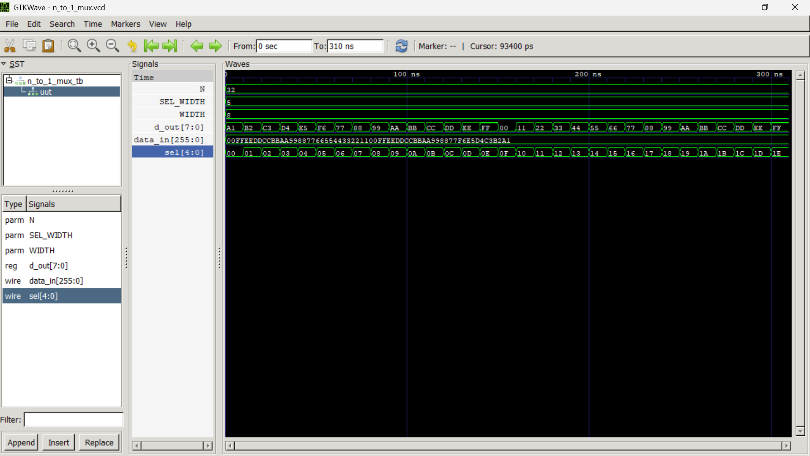

# N-to-1 Multiplexer Simulation Using Icarus Verilog and GTKWave

| Details | Information |
|---|---|
| **Student Name** | Neev Badu |
| **Roll Number** | THA079BEI015 |
| **Lab Assignment** | Design and Simulation of an N-to-1 Multiplexer |
| **Tools Used** | Icarus Verilog (`iverilog`) and GTKWave |

---

## 1. Objective

To design, simulate, and verify the operation of a parameterized **N-to-1 multiplexer** using Verilog HDL. The design is compiled and simulated using **Icarus Verilog**, and its waveform is examined using **GTKWave**.

---

## 2. Brief Introduction

A multiplexer (MUX) is a combinational digital circuit that selects one input from several input lines and transfers the selected input to a single output line.

For an **N-to-1 multiplexer**:

- Number of input words = `N`
- Width of each input word = `WIDTH`
- Required selector bits = `log2(N)`
- Output width = `WIDTH`

In this implementation:

- `N = 32`
- `WIDTH = 8 bits`
- Selector width = `log2(32) = 5 bits`

Thus, the design behaves as a **32-to-1 multiplexer with 8-bit data inputs**.

### Functional Relation

```text
d_out = data_in[sel]
```

The selector `sel[4:0]` chooses one of the 32 available 8-bit input data words. The selected value appears at `d_out[7:0]`.

---

## 3. Files Included

```text
n_to_1_mux_submission/
│
├── n_to_1_mux.v                 # Verilog design module
├── n_to_1_mux_tb.v              # Verilog testbench
├── n_to_1_mux.vcd               # Generated waveform file after simulation
├── README.md                     # Assignment documentation
└── images/
    └── n_to_1_mux_gtkwave_output.png
```


---

## 4. Simulation Procedure

### Step 1: Compile the Verilog files

```bash
iverilog -o n_to_1_mux_sim n_to_1_mux.v n_to_1_mux_tb.v
```

### Step 2: Run the simulation

```bash
vvp n_to_1_mux_sim
```

This generates the waveform file:

```text
n_to_1_mux.vcd
```

### Step 3: Open the waveform in GTKWave

```bash
gtkwave n_to_1_mux.vcd
```

---

## 5. Verification and Result

The testbench applies multiple selector values to `sel[4:0]` and verifies that the output `d_out[7:0]` changes according to the corresponding selected 8-bit input data.

From the waveform:

- `sel` is varied sequentially from `00` onward.
- Each selector value selects a different 8-bit segment from `data_in[255:0]`.
- `d_out[7:0]` changes correctly according to the selected input.
- Therefore, the parameterized N-to-1 multiplexer operates correctly.

### GTKWave Output



---

## 6. Conclusion

The parameterized N-to-1 multiplexer was successfully implemented in Verilog HDL and simulated using Icarus Verilog. GTKWave waveform verification confirms that the output data changes correctly with the selector input. Hence, the N-to-1 multiplexer design is verified successfully.
