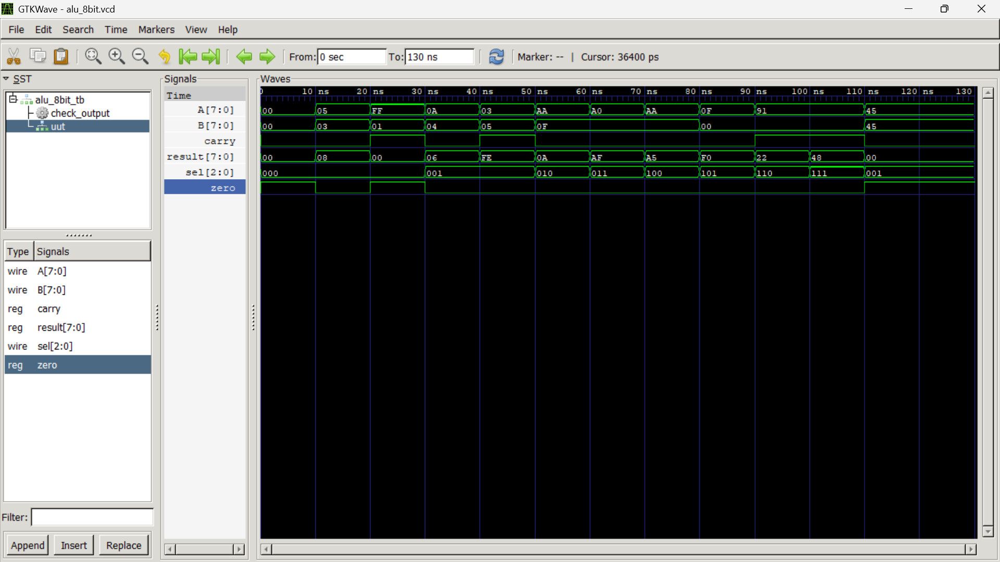

# 8-Bit ALU Design and Simulation Using Verilog HDL

| Details | Information |
|---|---|
| **Student Name** | Neev Badu |
| **Roll Number** | THA079BEI015 |
| **Assignment** | Assignment 2 – Implement 8-Bit ALU in Verilog |
| **Tools Used** | Icarus Verilog and GTKWave |
| **Design Type** | Combinational Logic Circuit |

---

## 1. Objective

The objective of this assignment is to design, simulate, and verify an **8-bit Arithmetic Logic Unit (ALU)** using Verilog HDL.

The designed ALU performs arithmetic, logical, and bit-shift operations based on a 3-bit control signal. The output is verified using a Verilog testbench and observed using GTKWave waveform simulation.

---

## 2. Introduction

An **Arithmetic Logic Unit (ALU)** is an important combinational digital circuit used in processors, microcontrollers, and digital systems.

It performs operations on binary inputs, such as:

- Addition
- Subtraction
- Bitwise AND
- Bitwise OR
- Bitwise XOR
- Bitwise NOT
- Logical left shift
- Logical right shift

In this assignment, the ALU accepts two 8-bit input operands, `A` and `B`. A 3-bit selection signal, `sel`, chooses one out of eight operations.

The ALU provides:

- An 8-bit output result
- A carry/borrow/shifted-out bit flag
- A zero-result flag

Since this is a **combinational circuit**, the outputs change whenever `A`, `B`, or `sel` changes. No clock signal is required.

---

## 3. Project Folder Structure

```text
REPORT_2/
│
├── alu_8bit.v        # Main 8-bit ALU design file
├── alu_8bit_tb.v     # Testbench for simulation and verification
├── alu_8bit.vcd      # Generated waveform file
├── alu_sim           # Compiled simulation output
├── output.png        # GTKWave waveform screenshot
└── README.md         # Assignment documentation
```

---

## 4. ALU Block Diagram

```text
                     ┌─────────────────────────────┐
 A[7:0] ────────────►│                             │
                     │                             │
 B[7:0] ────────────►│         8-BIT ALU           │────► result[7:0]
                     │                             │────► carry
 sel[2:0] ──────────►│                             │────► zero
                     │                             │
                     └─────────────────────────────┘
```

### Signal Flow

```text
Inputs A, B, sel
        │
        ▼
Operation selected using sel
        │
        ▼
Arithmetic / logic / shift operation performed
        │
        ▼
Result and carry generated
        │
        ▼
Zero flag generated from result
```

---

## 5. Input and Output Ports

| Signal | Width | Direction | Description |
|---|---:|---|---|
| `A` | 8-bit | Input | First operand of the ALU |
| `B` | 8-bit | Input | Second operand of the ALU |
| `sel` | 3-bit | Input | Selects one of eight ALU operations |
| `result` | 8-bit | Output | Result of the selected ALU operation |
| `carry` | 1-bit | Output | Carry, borrow, or shifted-out bit |
| `zero` | 1-bit | Output | Becomes `1` when the result is zero |

---

## 6. ALU Operation Table

| `sel[2:0]` | Operation | Verilog Expression | Description |
|---|---|---|---|
| `000` | Addition | `A + B` | Adds two 8-bit operands |
| `001` | Subtraction | `A - B` | Subtracts `B` from `A` |
| `010` | Bitwise AND | `A & B` | Performs bit-by-bit AND operation |
| `011` | Bitwise OR | `A \| B` | Performs bit-by-bit OR operation |
| `100` | Bitwise XOR | `A ^ B` | Performs bit-by-bit XOR operation |
| `101` | Bitwise NOT | `~A` | Complements every bit of `A` |
| `110` | Logical Left Shift | `A << 1` | Shifts `A` left by one bit |
| `111` | Logical Right Shift | `A >> 1` | Shifts `A` right by one bit |

---

## 7. Design Methodology

The ALU is implemented as a **combinational circuit** using an `always @(*)` block.

```verilog
always @(*)
```

This block executes automatically whenever any input used inside it changes.

A `case(sel)` statement is used to select the operation.

```verilog
case (sel)
    3'b000: // Addition
    3'b001: // Subtraction
    3'b010: // AND
    3'b011: // OR
    3'b100: // XOR
    3'b101: // NOT
    3'b110: // Left Shift
    3'b111: // Right Shift
endcase
```

Default assignments are given to `result`, `carry`, and `zero` before the `case` statement. This prevents unwanted latch generation.

---

## 8. Explanation of ALU Operations

### 8.1 Addition

The ALU adds two 8-bit numbers.

```verilog
{carry, result} = A + B;
```

The expression uses concatenation to store the 9-bit output:

```text
{carry, result}
```

- `result` stores the lower 8 bits.
- `carry` stores the extra ninth bit.

### Example

```text
 A = 11111111 = FF hexadecimal
 B = 00000001 = 01 hexadecimal
--------------------------------
 A + B = 1 00000000
```

Therefore:

```text
result = 00000000 = 00
carry  = 1
zero   = 1
```

---

### 8.2 Subtraction

The ALU subtracts `B` from `A`.

```verilog
result = A - B;
```

For this design, the carry output is used as a **borrow indicator**.

```text
carry = 0  → No borrow occurred
carry = 1  → Borrow occurred because A < B
```

### Example: No Borrow

```text
A = 0A hexadecimal = 10 decimal
B = 04 hexadecimal = 4 decimal

A - B = 06 hexadecimal
```

Output:

```text
result = 06
carry  = 0
```

### Example: Borrow Occurs

```text
A = 03 hexadecimal
B = 05 hexadecimal

A - B = -2
```

In 8-bit two's complement form:

```text
-2 = FE hexadecimal
```

Therefore:

```text
result = FE
carry  = 1
```

---

### 8.3 Bitwise AND

Bitwise AND compares each corresponding bit of `A` and `B`.

| A | B | A AND B |
|---:|---:|---:|
| 0 | 0 | 0 |
| 0 | 1 | 0 |
| 1 | 0 | 0 |
| 1 | 1 | 1 |

```verilog
result = A & B;
```

### Example

```text
 A = AA = 10101010
 B = 0F = 00001111
---------------------
 A & B = 00001010 = 0A
```

---

### 8.4 Bitwise OR

Bitwise OR produces `1` when at least one input bit is `1`.

| A | B | A OR B |
|---:|---:|---:|
| 0 | 0 | 0 |
| 0 | 1 | 1 |
| 1 | 0 | 1 |
| 1 | 1 | 1 |

```verilog
result = A | B;
```

### Example

```text
 A = A0 = 10100000
 B = 0F = 00001111
---------------------
 A | B = 10101111 = AF
```

---

### 8.5 Bitwise XOR

Bitwise XOR produces `1` when the corresponding bits are different.

| A | B | A XOR B |
|---:|---:|---:|
| 0 | 0 | 0 |
| 0 | 1 | 1 |
| 1 | 0 | 1 |
| 1 | 1 | 0 |

```verilog
result = A ^ B;
```

### Example

```text
 A = AA = 10101010
 B = 0F = 00001111
---------------------
 A ^ B = 10100101 = A5
```

---

### 8.6 Bitwise NOT

The NOT operation complements every bit of input `A`.

```verilog
result = ~A;
```

### Example

```text
 A  = 0F = 00001111
 ~A = F0 = 11110000
```

For this operation, input `B` is not used.

---

### 8.7 Logical Left Shift

Logical left shift moves every bit of `A` one position to the left.

```verilog
result = A << 1;
carry  = A[7];
```

- The original MSB, `A[7]`, is shifted out.
- The shifted-out MSB is stored in `carry`.
- A `0` enters at the LSB position.

### Example

```text
 A = 91 = 10010001

 A << 1 = 00100010 = 22
 carry  = 1
```

---

### 8.8 Logical Right Shift

Logical right shift moves every bit of `A` one position to the right.

```verilog
result = A >> 1;
carry  = A[0];
```

- The original LSB, `A[0]`, is shifted out.
- The shifted-out LSB is stored in `carry`.
- A `0` enters at the MSB position.

### Example

```text
 A = 91 = 10010001

 A >> 1 = 01001000 = 48
 carry  = 1
```

---

## 9. Status Flags

### 9.1 Carry Flag

The meaning of the `carry` flag depends on the selected operation.

| Operation | Meaning of `carry` |
|---|---|
| Addition | Extra ninth bit from addition |
| Subtraction | Borrow indicator when `A < B` |
| Left Shift | Original MSB, `A[7]` |
| Right Shift | Original LSB, `A[0]` |
| AND, OR, XOR, NOT | `0` |

---

### 9.2 Zero Flag

The `zero` flag becomes `1` when the ALU result is equal to zero.

```verilog
zero = (result == 8'b00000000);
```

| Result | `zero` Flag |
|---|---:|
| `00000000` | 1 |
| Any non-zero value | 0 |

### Example

```text
A = 45 hexadecimal
B = 45 hexadecimal

A - B = 00
```

Therefore:

```text
result = 00
zero   = 1
```

---

## 10. Testbench Description

The file `alu_8bit_tb.v` is used to verify the ALU functionality.

The testbench performs the following tasks:

1. Declares `A`, `B`, and `sel` as input registers.
2. Declares `result`, `carry`, and `zero` as output wires.
3. Instantiates the `alu_8bit` module.
4. Applies test cases for all eight ALU operations.
5. Generates a waveform file named `alu_8bit.vcd`.
6. Uses a checking task to compare actual and expected outputs.
7. Displays `PASS` or `FAIL` messages in the terminal.

The waveform is generated using:

```verilog
$dumpfile("alu_8bit.vcd");
$dumpvars(0, alu_8bit_tb);
```

---

## 11. Test Cases and Verification

| Test No. | `A` | `B` | `sel` | Operation | Expected `result` | Expected `carry` | Expected `zero` |
|---:|---:|---:|---:|---|---:|---:|---:|
| 1 | `05` | `03` | `000` | Addition | `08` | 0 | 0 |
| 2 | `FF` | `01` | `000` | Addition with carry | `00` | 1 | 1 |
| 3 | `0A` | `04` | `001` | Subtraction without borrow | `06` | 0 | 0 |
| 4 | `03` | `05` | `001` | Subtraction with borrow | `FE` | 1 | 0 |
| 5 | `AA` | `0F` | `010` | AND | `0A` | 0 | 0 |
| 6 | `A0` | `0F` | `011` | OR | `AF` | 0 | 0 |
| 7 | `AA` | `0F` | `100` | XOR | `A5` | 0 | 0 |
| 8 | `0F` | `00` | `101` | NOT A | `F0` | 0 | 0 |
| 9 | `91` | `00` | `110` | Logical Left Shift | `22` | 1 | 0 |
| 10 | `91` | `00` | `111` | Logical Right Shift | `48` | 1 | 0 |
| 11 | `45` | `45` | `001` | Zero Flag Verification | `00` | 0 | 1 |

---

## 12. Simulation Procedure

### Step 1: Compile the Verilog Files

Open terminal or command prompt inside the project folder and run:

```bash
iverilog -o alu_sim alu_8bit.v alu_8bit_tb.v
```

### Command Explanation

| Command Part | Meaning |
|---|---|
| `iverilog` | Icarus Verilog compiler |
| `-o alu_sim` | Creates simulation output named `alu_sim` |
| `alu_8bit.v` | Main ALU design file |
| `alu_8bit_tb.v` | Testbench file |

If the compilation is successful, no syntax errors will appear.

---

### Step 2: Run the Simulation

```bash
vvp alu_sim
```

The terminal displays the test result for every operation.

Expected result pattern:

```text
PASS --> Result=08 Carry=0 Zero=0
PASS --> Result=00 Carry=1 Zero=1
```

All test cases should display `PASS`.

---

### Step 3: View Waveform in GTKWave

```bash
gtkwave alu_8bit.vcd
```

Add the following signals to the waveform window:

```text
A[7:0]
B[7:0]
sel[2:0]
result[7:0]
carry
zero
```

---

## 13. Simulation Waveform

The following waveform was generated after simulating the ALU design with the testbench.



The waveform verifies the changing values of:

- Input operand `A`
- Input operand `B`
- ALU operation select input `sel`
- Output result `result`
- Carry/borrow/shift bit `carry`
- Zero result flag `zero`

---

## 14. Waveform Interpretation

| Time Interval | `A` | `B` | `sel` | Operation | `result` | `carry` | `zero` |
|---|---:|---:|---:|---|---:|---:|---:|
| 10–20 ns | `05` | `03` | `000` | Addition | `08` | 0 | 0 |
| 20–30 ns | `FF` | `01` | `000` | Addition with Carry | `00` | 1 | 1 |
| 30–40 ns | `0A` | `04` | `001` | Subtraction | `06` | 0 | 0 |
| 40–50 ns | `03` | `05` | `001` | Subtraction with Borrow | `FE` | 1 | 0 |
| 50–60 ns | `AA` | `0F` | `010` | Bitwise AND | `0A` | 0 | 0 |
| 60–70 ns | `A0` | `0F` | `011` | Bitwise OR | `AF` | 0 | 0 |
| 70–80 ns | `AA` | `0F` | `100` | Bitwise XOR | `A5` | 0 | 0 |
| 80–90 ns | `0F` | `00` | `101` | Bitwise NOT | `F0` | 0 | 0 |
| 90–100 ns | `91` | `00` | `110` | Logical Left Shift | `22` | 1 | 0 |
| 100–110 ns | `91` | `00` | `111` | Logical Right Shift | `48` | 1 | 0 |
| 110–120 ns | `45` | `45` | `001` | Zero Flag Test | `00` | 0 | 1 |

### Key Observations

1. **Addition with carry:**  
   At `20–30 ns`, `FF + 01 = 100` hexadecimal. The result is `00`, while the ninth bit is stored in `carry = 1`.

2. **Subtraction with borrow:**  
   At `40–50 ns`, `03 - 05 = FE` in 8-bit two's complement representation. Since `A < B`, `carry = 1` indicates borrow.

3. **Left shift:**  
   At `90–100 ns`, `91` is shifted left and gives `22`. The original MSB is `1`, so `carry = 1`.

4. **Right shift:**  
   At `100–110 ns`, `91` is shifted right and gives `48`. The original LSB is `1`, so `carry = 1`.

5. **Zero flag:**  
   At `110–120 ns`, `45 - 45 = 00`, so `zero = 1`.

---

## 15. Important Verilog Concepts Used

### Module

A module is the main hardware block in Verilog.

```verilog
module alu_8bit (...);
```

---

### `reg`

Signals assigned inside an `always` block are declared as `reg`.

```verilog
output reg [7:0] result;
output reg carry;
output reg zero;
```

---

### `wire`

Signals driven by the ALU module in the testbench are declared as `wire`.

```verilog
wire [7:0] result;
wire carry;
wire zero;
```

---

### `always @(*)`

Used to define combinational logic.

```verilog
always @(*)
```

It reacts whenever any input signal changes.

---

### `case` Statement

Used for selecting the ALU operation based on `sel`.

```verilog
case (sel)
    3'b000: // Addition
    3'b001: // Subtraction
    ...
endcase
```

---

### Concatenation Operator

The concatenation operator combines multiple signals.

```verilog
{carry, result} = A + B;
```

Here, the 9-bit addition output is divided into:

```text
carry  → Most significant bit
result → Lower 8 bits
```

---

## 16. Result

The simulation waveform and testbench output verify that the 8-bit ALU correctly performs:

- Addition
- Subtraction
- AND
- OR
- XOR
- NOT
- Left Shift
- Right Shift
- Carry/borrow handling
- Zero flag generation

All applied test cases produce the expected outputs.

---

## 17. Conclusion

An 8-bit Arithmetic Logic Unit was successfully designed and simulated using Verilog HDL.

The ALU performs eight different arithmetic, logical, and shift operations using a 3-bit selection input. The `result`, `carry`, and `zero` outputs were verified through a Verilog testbench and GTKWave waveform.

This assignment provided practical understanding of:

- Combinational circuit design
- Verilog modules and ports
- `always @(*)` blocks
- `case` statements
- Testbench design
- Waveform generation
- Functional verification using Icarus Verilog and GTKWave