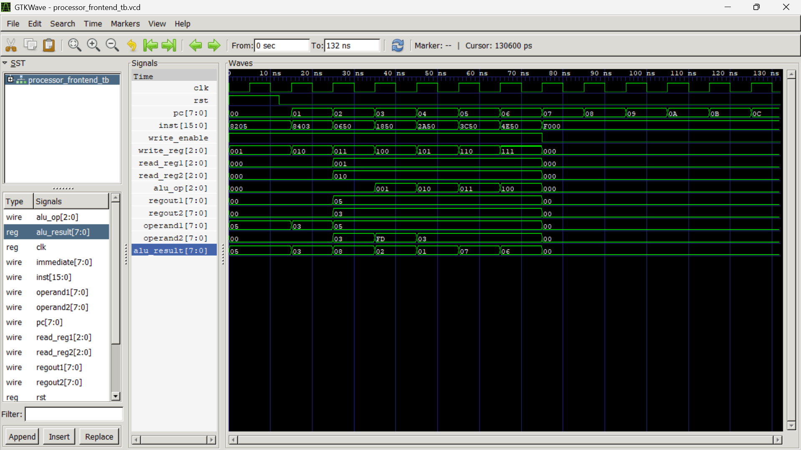

# 8-Bit Processor Frontend Design in Verilog

## Assignment Title

**Implementation and Simulation of Control Unit, Instruction Memory, and 8x8 Register File for an 8-bit Processor**

---

| Details | Information |
|---|---|
| **Student Name** | Neev Badu |
| **Roll Number** | THA079BEI015 |
| **Tools Used** | Icarus Verilog and GTKWave |

---

## Objective

The objective of this assignment is to implement the basic frontend part of an 8-bit processor using Verilog HDL.

The design includes:

- Instruction Memory
- Control Unit
- Program Counter
- 8x8 Register File
- Operand selection logic
- Temporary ALU result logic for simulation

The design was compiled and simulated using **Icarus Verilog**, and the waveform was verified using **GTKWave**.

---

## Processor Architecture Overview

The implemented architecture follows this basic flow:

```text
Program Counter (PC)
        ↓
Instruction Memory
        ↓
16-bit Instruction
        ↓
Control Unit
        ↓
Control Signals
        ↓
Register File
        ↓
Operand1 and Operand2
        ↓
ALU / Temporary ALU Logic
        ↓
ALU Result
        ↓
Write Back to Register File
```

In simple words, the **Program Counter** selects an instruction from instruction memory. The **Control Unit** decodes the instruction and generates the required control signals. The **Register File** reads operands and stores results. The **ALU result** is written back to the selected register.

---

## Files Included

| File Name | Description |
|---|---|
| `processor_frontend.v` | Main Verilog design file containing instruction memory, control unit, register file, and top module |
| `processor_frontend_tb.v` | Testbench used for simulation |
| `processor_frontend_tb.vcd` | Waveform file generated after simulation |
| `processor_sim` | Compiled simulation output generated by Icarus Verilog |
| `output.png` | GTKWave output screenshot |

---

## Modules Implemented

---

## 1. Instruction Memory

The instruction memory stores 16-bit instructions.

```verilog
module instruction_memory(
    input  wire [7:0]  pc,
    output wire [15:0] inst
);
```

### Function

The instruction memory takes the current value of the Program Counter `pc` and outputs the corresponding 16-bit instruction `inst`.

```text
pc → instruction_memory → inst
```

Example:

```text
PC = 0 → LDI R1, 5
PC = 1 → LDI R2, 3
PC = 2 → ADD R3, R1, R2
```

---

## 2. Control Unit

The control unit is responsible for decoding the instruction and generating control signals.

```verilog
module control_unit(
    input  wire        clk,
    input  wire        rst,
    input  wire [15:0] inst,

    output reg  [7:0]  pc,

    output reg  [2:0]  read_reg1,
    output reg  [2:0]  read_reg2,
    output reg  [2:0]  write_reg,
    output reg         write_enable,

    output reg  [7:0]  immediate,
    output reg         sel_2s_comp,
    output reg         sel_operand1,

    output reg  [2:0]  alu_op
);
```

### Main Functions of Control Unit

- Increments the Program Counter
- Decodes opcode
- Selects source registers
- Selects destination register
- Enables or disables register writing
- Selects ALU operation
- Controls immediate data usage
- Controls 2's complement selection for subtraction

---

## 3. 8x8 Register File

The register file contains 8 registers, each of 8-bit size.

```verilog
reg [7:0] regs [0:7];
```

This means:

```text
R0, R1, R2, R3, R4, R5, R6, R7
```

Each register can store one 8-bit value.

### Register File Ports

```verilog
module register_file_8x8(
    input  wire       clk,
    input  wire       rst,

    input  wire [2:0] read_reg1,
    input  wire [2:0] read_reg2,
    input  wire [2:0] write_reg,

    input  wire [7:0] write_data,
    input  wire       write_enable,

    output wire [7:0] regout1,
    output wire [7:0] regout2
);
```

### Features

- Two registers can be read at the same time.
- One register can be written at a time.
- Write operation happens on clock edge.
- Reset clears all registers to zero.

```text
read_reg1 → regout1
read_reg2 → regout2
write_reg + write_data + write_enable → register write
```

---

## Instruction Format

A 16-bit instruction format is used.

---

## R-Type Instruction Format

R-type instructions are used for register-to-register operations.

```text
[15:12] opcode
[11:9]  write_reg
[8:6]   read_reg1
[5:3]   read_reg2
[2:0]   unused
```

Example:

```text
ADD R3, R1, R2
```

Meaning:

```text
R3 = R1 + R2
```

---

## Immediate Instruction Format

Immediate instructions are used when data is directly available inside the instruction.

```text
[15:12] opcode
[11:9]  write_reg
[8]     unused
[7:0]   immediate value
```

Example:

```text
LDI R1, 5
```

Meaning:

```text
R1 = 5
```

---

## Opcode and ALU Operation

| Opcode | Instruction | Meaning |
|---|---|---|
| `0000` | ADD | Add two registers |
| `0001` | SUB | Subtract two registers |
| `0010` | AND | Bitwise AND |
| `0011` | OR | Bitwise OR |
| `0100` | XOR | Bitwise XOR |
| `0101` | INC | Increment |
| `0110` | DEC | Decrement |
| `0111` | CMP | Compare |
| `1000` | LDI | Load immediate |
| `1111` | NOP | No operation |

---

## ALU Operation Codes

| ALUOP | Operation | Function |
|---|---|---|
| `000` | ADD | `A + B` |
| `001` | SUB | `A - B` |
| `010` | AND | `A & B` |
| `011` | OR | `A | B` |
| `100` | XOR | `A ^ B` |
| `101` | INC | `A + 1` |
| `110` | DEC | `A - 1` |
| `111` | CMP | Compare |

---

## Sample Program Stored in Instruction Memory

The following sample instructions were stored inside the instruction memory:

```text
PC = 0: LDI R1, 5
PC = 1: LDI R2, 3
PC = 2: ADD R3, R1, R2
PC = 3: SUB R4, R1, R2
PC = 4: AND R5, R1, R2
PC = 5: OR  R6, R1, R2
PC = 6: XOR R7, R1, R2
```

---

## Expected Result of Sample Program

| Instruction | Operation | Expected Result |
|---|---|---|
| `LDI R1, 5` | Load immediate value 5 into R1 | `R1 = 5` |
| `LDI R2, 3` | Load immediate value 3 into R2 | `R2 = 3` |
| `ADD R3, R1, R2` | Add R1 and R2 | `R3 = 8` |
| `SUB R4, R1, R2` | Subtract R2 from R1 | `R4 = 2` |
| `AND R5, R1, R2` | Bitwise AND | `R5 = 1` |
| `OR R6, R1, R2` | Bitwise OR | `R6 = 7` |
| `XOR R7, R1, R2` | Bitwise XOR | `R7 = 6` |

---

## Signal Description

| Signal | Size | Description |
|---|---:|---|
| `clk` | 1-bit | Clock signal |
| `rst` | 1-bit | Reset signal |
| `pc` | 8-bit | Program Counter |
| `inst` | 16-bit | Current instruction |
| `read_reg1` | 3-bit | Address of first source register |
| `read_reg2` | 3-bit | Address of second source register |
| `write_reg` | 3-bit | Address of destination register |
| `write_enable` | 1-bit | Enables register write |
| `immediate` | 8-bit | Immediate value from instruction |
| `alu_op` | 3-bit | ALU operation selection |
| `regout1` | 8-bit | Output from first selected register |
| `regout2` | 8-bit | Output from second selected register |
| `operand1` | 8-bit | First operand going to ALU |
| `operand2` | 8-bit | Second operand going to ALU |
| `alu_result` | 8-bit | Result from ALU or temporary ALU logic |

---

## Tools Used

| Tool | Purpose |
|---|---|
| Icarus Verilog | To compile Verilog code |
| VVP | To run compiled simulation |
| GTKWave | To view waveform output |

---

## Compilation and Simulation Steps

### Step 1: Compile the Verilog Files

```bash
iverilog -o processor_sim processor_frontend.v processor_frontend_tb.v
```

This command compiles the Verilog design and testbench files.

---

### Step 2: Run the Simulation

```bash
vvp processor_sim
```

This command runs the compiled simulation file.

---

### Step 3: Open the Waveform in GTKWave

```bash
gtkwave processor_frontend_tb.vcd
```

This command opens the generated waveform file in GTKWave.

---

## GTKWave Observation

The waveform was observed using GTKWave.

The following signals were added to the waveform window:

```text
clk
rst
pc
inst
write_enable
write_reg
read_reg1
read_reg2
alu_op
regout1
regout2
operand1
operand2
alu_result
```

---

## Waveform Output Screenshot

The GTKWave output screenshot is shown below:



> Note: The image file `output.png` must be in the same folder as this `README.md` file for the image to display properly.

---

## Waveform Explanation

From the waveform:

- The clock signal toggles continuously.
- Reset initializes the processor.
- The Program Counter increments after every clock cycle.
- Instruction memory outputs a new instruction according to the PC value.
- The Control Unit decodes the instruction.
- Register addresses are generated.
- Register File outputs `regout1` and `regout2`.
- Operand selection logic generates `operand1` and `operand2`.
- ALU result is calculated.
- The result is written back to the selected register when `write_enable = 1`.

---

## Example Waveform Interpretation

### PC = 0

```text
Instruction = 8205
Operation   = LDI R1, 5
Result      = R1 = 5
```

### PC = 1

```text
Instruction = 8403
Operation   = LDI R2, 3
Result      = R2 = 3
```

### PC = 2

```text
Instruction = 0650
Operation   = ADD R3, R1, R2
Operand1    = 5
Operand2    = 3
ALU Result  = 8
Result      = R3 = 8
```

### PC = 3

```text
Operation   = SUB R4, R1, R2
Operand1    = 5
Operand2    = 2's complement of 3
ALU Result  = 2
Result      = R4 = 2
```

### PC = 4

```text
Operation   = AND R5, R1, R2
Operand1    = 5
Operand2    = 3
ALU Result  = 1
Result      = R5 = 1
```

### PC = 5

```text
Operation   = OR R6, R1, R2
Operand1    = 5
Operand2    = 3
ALU Result  = 7
Result      = R6 = 7
```

### PC = 6

```text
Operation   = XOR R7, R1, R2
Operand1    = 5
Operand2    = 3
ALU Result  = 6
Result      = R7 = 6
```

---

## Result

The simulation output verifies that the processor frontend works correctly.

Successfully verified operations:

- Instruction fetch
- Instruction decode
- Program counter increment
- Register read operation
- Register write operation
- Immediate value loading
- ALU operand generation
- ALU result write-back

---

## Conclusion

In this assignment, the frontend of an 8-bit processor was designed and simulated using Verilog HDL.

The implemented system includes instruction memory, control unit, program counter, and 8x8 register file. The waveform confirms that instructions are fetched sequentially, decoded properly, and the results are written back to the register file.

---

## Future Improvements

This design can be extended by adding:

- Complete ALU module
- Data memory
- Branch instructions
- Jump instructions
- Flag register
- Complete processor datapath
- FPGA board implementation

---

## Summary

```text
Instruction Memory stores instructions.
Control Unit decodes instructions.
Register File stores data.
Operand logic prepares ALU inputs.
ALU result is written back to registers.
```

This forms the basic frontend of an 8-bit processor.